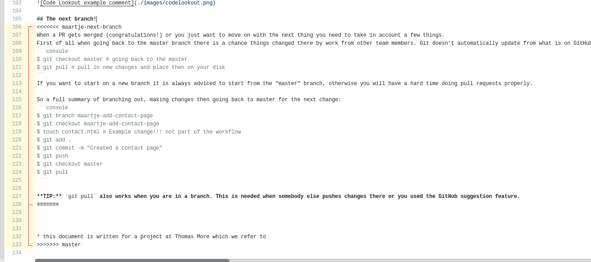
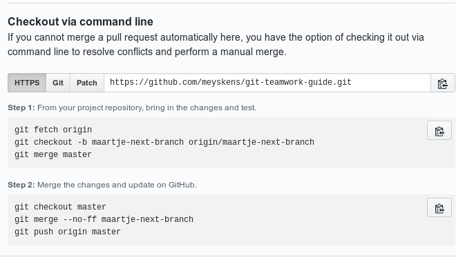

# Merge conflicts

Merge conflicts happen when Git cannot figure out how to merge 2 changes made in the same file.
When these happen GitHub will indicate an error on the PR page.


There are two ways of solving these, the first is a web interface that GitHub offers, this is the easiest way but may not work on other Git platforms or when a merge conflict is complex. The other way of solving merge conflicts is via the command line. This involves a few commands.

## Web interface
In the PR view on GitHub you press "Resolve Conflicts" this will send you to a page where you have one or more files with one or more conflicts.
Go into each file you see and look for a red indicated part of the file.



You will see the standard Git formatting for merge conflicts:
```
<<<<<<<<<< [Branch Name]
    code added in the branch

==========
    code on the master
>>>>>>>>>> master
```

Now you need to make sure you remove all the added lines and end up with the file you want to obtain in the end. When you fixed all of these you click "Mark as resolved" on the file, when all files have a green checkmark you can save it.

Now you are being sent back to the PR screen where you can now merge without issues.

## Command Line
You can do the same process for merge requests using the Git command line interface. If you need any help with this you can click on "command line instructions" on a PR and GitHub will help you out!


First you make sure you got all changes from GitHub:
```console
$ git fetch # downloads latest GitHub data but don't overwrite files
```
Next make sure you are on the branch you are working in
```console
$ git checkout -b name-branch origin/name-branch
```
Then you merge changes from the master into the branch
```
$ git merge master
```
Now you will see an error with a conflict and a file name.
Go into that file you will see the standard Git formatting for merge conflicts:
```
<<<<<<<<<< [Branch Name]
    code added in the branch

==========
    code on the master
>>>>>>>>>> master
```

Now you need to make sure you remove all the added lines and end up with the file you want to obtain in the end. Then save the file to the disk

Then we need to commit those changes
```console
$ git add .
$ git commit # note there is no -m as we want to keep the default message
```
You will see a text editor open, do not change anything here and close the editor. This will keep the default merge commit message.

You can now push the changes to GitHub using `git push`. 
(The last instructions GitHub gives you is to do a manual pull request merge.)