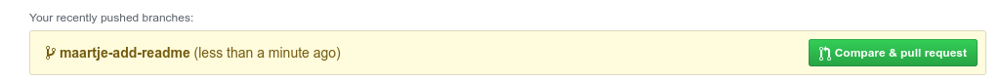
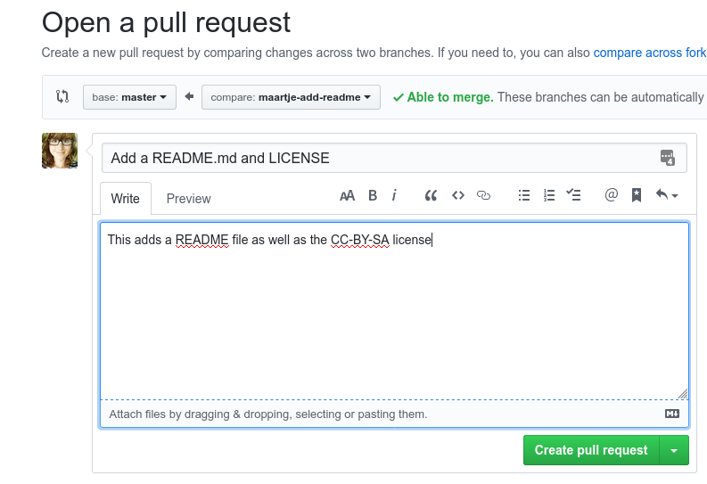
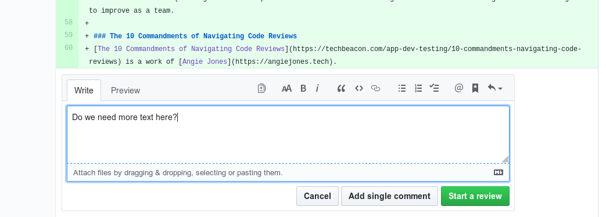
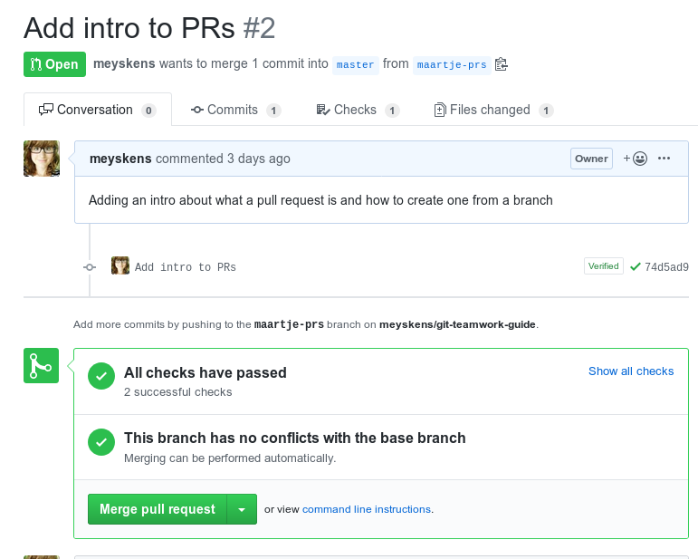
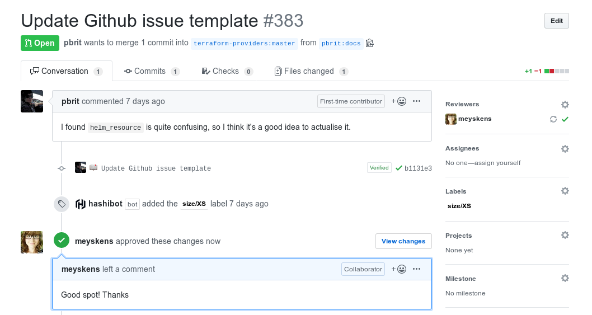
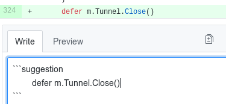
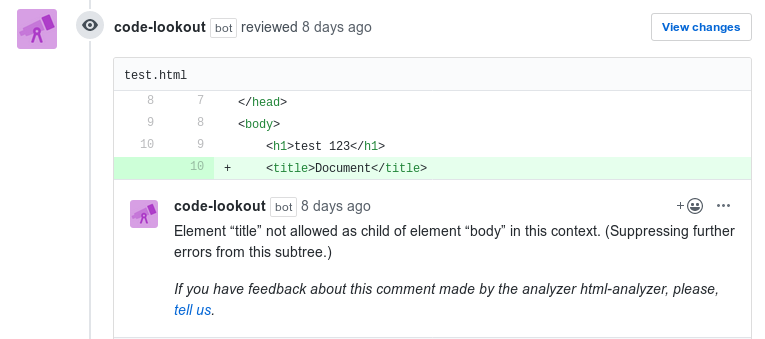

# GitHub teamwork workflow

In the past you already learned how to use GitHub and Git to do versioncontrol on your projects.  
In this tutorial we're going one step further and use Git to allow working in team on the same codebase.

## Working with branches
After you cloned the project on your computer we can start working on code changes. We do this in branches.
Branches, also called feature branches, make a copy of the main code which resides on the "master" branch.
It is a bad practice to push directly to the "master" branch when working in teams. An exception for this rule is the first commit.
In a branch you can make one or more commits as usual, these reflect the changes to add a certain part of the code. 
To make a new branch you can do the following using Git
```console
$ git branch [branch name]
```
The branch name should contain the part you plan to add, as well as your name so you have no conflicts with your teammates.
A name for example could be `maartje-add-contact-page`, note that branch names cannot contain spaces!

Creating branches is done using `git branch`. After creating the branch you have to switch to using that branch.
This can be done using `git checkout`.
```console
$ git checkout [branch name]
```
This command will change your files on your hard disk to reflect those in the branch.

You can now work as usual and use `git add` and `git commit` to commit your changes.
You can use `git push` when on a branch to push the branch to GitHub

A full workflow for example would be
```console
$ git branch maartje-add-contact-page
$ git checkout maartje-add-contact-page
$ touch contact.html # Example change!!! not part of the workflow
$ git add .
$ git commit -m "Created a contact page"
$ git push --set-upstream origin maartje-add-contact-page # needed first time, just use `git push` for later changes in the branch
```

## Pull Requests

Pull requests, also called Merge Requests in other Git solutions, are requests made to merge code from a certain branch into the "master" of the repository. You can do this after doing "git push" for the first time by going to the repository on Github and going to "Pull Requests", here you can click "New Pull Request".

Sometimes GitHub will also suggest you the new branch automatically. 

When creating a Pull Request you can compare 2 branches, the "base" branch is the one we want to move the code into. In our case this will always be the master branch. The "compare" branch will be the branch we made our changes in. Note that you *can* push a branch without any changes made, however you can not create a pull request for these.

After these are set to the correct GitHub will show you the changes and you can click on "Create Pull Request".

You will now be sent to a screen where you can add a title and a description, when working in Git you will often make pull requests to other people's projects. This is why it is always a good practice to add a useful title and description of what you want to change and why. When this is done do not forget to click "Create" again.

## Code Review
Code review is a process that you can see everywhere, from small startups to big enterprises. How to properly do one is also a very discussed topic. When asking on [Twitter](https://twitter.com/MaartjeME/status/1208048751631327237) for code review tips many programmers had different opinions on this.  
Code review in a nutshell is the process between proposing a code change (in a PR) and it being merged into the master branch, and deployed into production.
This process allows for code to improve as more people can look at it and propose changes to the code. Bugs are spotted faster, the code will look better and more coherent and it might give you insight into how your code might be even more improved.

Code reviews are an opportunity to learn for the submitter of the PR but also an opportunity to praise one's work for the reviewer. Important to keep in mind is to be kind to eachother, not to take reviews personally and to start with explaining why. A code review is inherently teamwork, touching on different ideas and suggestions. Sometimes it might be worth taking a discussion offline (meaning face to face) to discuss some comments. The goal here is not to be right about something but to improve as a team.

### The 10 Commandments of Navigating Code Reviews
[The 10 Commandments of Navigating Code Reviews](https://techbeacon.com/app-dev-testing/10-commandments-navigating-code-reviews) is a work of [Angie Jones](https://angiejones.tech).
In this she discusses 10 rules to follow when doing code review. 
```
I. Thou Shalt Not Take It Personally
II. Thou Shalt Not Marry the Code
III. Thou Shalt Consider All Feedback
IV. Thou Shalt Articulate Your Rationale
V. Thou Shalt Be Willing to Compromise
VI. Thou Shalt Contribute to Others’ Code Reviews
VII. Thou Shalt Treat Submitters How Thou Wants to Be Treated
VIII. Thou Shalt Not Be Intimidated by the Number of Comments
IX. Thou Shalt Not Repeat the Same Mistakes
X. Thou Shalt Embrace the Nits
```

### Code Review in practice
When opening a Pull Request in GitHub you can go to "Files Changed", here you can see all changes in a PR. When hovering over a line number you will see a plus icon, when you click that a box to add a comment will open.



Here you can chose "Add single comment" or "Start Review" in most cases you want the second one. This starts a new review and saves the comments but will only publish them after you finished reviewing all files. This allows you to publish them all at once and delete any ones you do not need (for example if you get why a certain thing is there after reading another file).
On the top you will now see a button "Finish Review". This allows you to add a final comment, you might want to think about the "be kind" part here. Then "approve" or "request changes", when everything is good to go you approve the PR otherwise you request some changes to be made, after these are done the submitter of the PR can re-request your review. Note that you cannot approve your own PRs.



After posting a review you will see the status in the PR. Under "Reviewers" on the right you can also request a re-review of a previous reviewer or a new person to review your code.



**TIP:** When writing a comment you can press the "Suggestion" button in the toolbar. This allows you to do a quick one line code change suggestion that can be applied in a single click.



### The life after code review
If you need to make changes in your code after a code review you can just do this on your Git branch! Just make another commit and you will see the changes appear in the PR, you will also notice that GitHub marks comments on changed lines so you can better see which comments were addressed.
**Before merging the PR into master at least one person should have reviewed (and approved) your code!** The only exception for this is if your team counts one person. 


### Assisted code review
(Tool-)Assisted code review is a recent phenomenon in code review. Many small things like errors in the code, or code formatting can be detected by tools.
When writing code we often have tests that run to tell if everything works, these tests have to work before being allowed to merge a PR into the codebase. This process is called "continuous integration".
Since we* will mostly use HTML and CSS we cannot do much with using a CI. But there are other tools to help us! 
You can install [Code Lookout](https://github.com/apps/code-lookout) on your GitHub repository (or all), this is a GitHub app that will review your PRs for any validation errors made in HTML and CSS and will post it as a comment.


## The next branch!
When a PR gets merged (congratulations!) or you just want to move on with the next thing you need to take in account a few things.
First of all when going back to the master branch there is a chance things changed there by work from other team members. Git doesn't automatically update from what is on GitHub, but you can do this:
```console
$ git checkout master # going back to the master
$ git pull # pull in new changes and place them on your disk
```
If you want to start on a new branch it is always adviced to start from the "master" branch, otherwise you will have a hard time doing pull requests properly.

So a full summary of branching out, making changes then going back to master for the next change:
```console
$ git branch maartje-add-contact-page
$ git checkout maartje-add-contact-page
$ touch contact.html # Example change!!! not part of the workflow
$ git add .
$ git commit -m "Created a contact page"
$ git push
$ git checkout master
$ git pull
```

**TIP:** `git pull` also works when you are in a branch. This is needed when somebody else pushes changes there or you used the GitHub suggestion feature.

`* this document is written for a project at Thomas More which we refer to`
